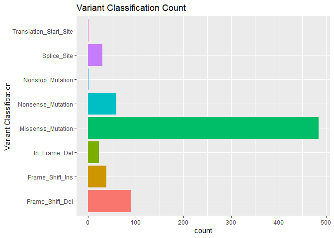

<!-- README.md is generated from README.Rmd. Please edit that file -->

# gnomeR

<!-- badges: start -->

[](https://github.com/MSKCC-Epi-Bio/gnomeR/actions)
[](https://app.codecov.io/gh/MSKCC-Epi-Bio/gnomeR?branch=main)

<!-- badges: end -->

<font size="5">:bangbang: :warning: **NOTE: This package is currently
under active development with a new stable release expected November
15th, 2022. For code written before 2022-03-23, please use the previous
stable version (v1.1.0)**:warning::bangbang: </font>

You can install the pre-2022-03-23 version with:

``` r
remotes::install_github('MSKCC-Epi-Bio/gnomeR@v1.1.0')
```

## Installation

You can install the development version of `gnomeR` from
[GitHub](https://github.com/) with:

``` r
# install.packages("devtools")
devtools::install_github("MSKCC-Epi-Bio/gnomeR")
```

Along with its companion package for cbioPortal data download:

``` r
devtools::install_github("karissawhiting/cbioportalr")
```

## Introduction

the `gnomeR` package provides a consistent framework for genetic data
processing, visualization and analysis. This is primarily targeted to
IMPACT datasets but can also be applied to any genomic data provided by
cBioPortal. With {gnomeR} and {cbioportalR} you can:

-   [**Download and gather data from
    CbioPortal**](https://www.karissawhiting.com/cbioportalR/) - Pull
    from cBioPortal data base by study ID or sample ID.
-   **OncoKB annotate data** - Filter genomic data for known oncogenic
    alterations.
-   **Process genomic data** - Process retrieved mutation/maf, fusions,
    copy-number alteration, and segmentation data (when available) into
    an analysis-ready formats.
-   **Visualize processed data** - Create OncoPrints, heatmaps and
    summary plots from processed data.
-   **Analyzing processed data**- Analyze associations between genomic
    variables and clinical variables or outcomes with summary tables,
    advanced visualizations, and univariate models.

## Getting Set up

{gnomeR} works with any genomic data that follows cBioPortal guidelines
for
[mutation](https://docs.cbioportal.org/5.1-data-loading/data-loading/file-formats#data-file-5),
[CNA](https://docs.cbioportal.org/5.1-data-loading/data-loading/file-formats#discrete-copy-number-data),
or
[fusion](https://docs.cbioportal.org/5.1-data-loading/data-loading/file-formats#structural-variant-data)
data file formats.

If you wish to pull the data directly from cBioPortal, see how to get
set up with credentials with the
[{cbioportalR}](https://karissawhiting.github.io/cbioportalR/) package.

## Processing Genomic Data

The below examples uses the data sets `mutatations`, `sv`, `cna` which
were pulled from cBioPortal and are included in the package as example
data sets. We will sample 100 samples for examples:

``` r
set.seed(123)

mut <- gnomeR::mutations
cna <- gnomeR::cna
sv <- gnomeR::sv

un <-  unique(mut$sampleId)
sample_patients <- sample(un, size = 100, replace = FALSE)
```

The main data processing function is `create_gene_binary()` which takes
mutation, CNA and fusion files as input, and outputs a binary matrix of
N rows (number of samples) by M genes included in the data set. We can
specify which patients are included which will force all patients in
resulting dataframe, even if they have no alterations.

``` r
gen_dat <- create_gene_binary(samples = sample_patients,
                         maf = mut,
                         fusion = sv,
                         cna = cna)

head(gen_dat[, 1:6])
#>                   ERG.fus KDM5A.fus KDM5D.fus GSK3B.fus EGFR.fus PBRM1.fus
#> P-0008869-T01-IM5       1         0         0         0        0         0
#> P-0001242-T01-IM3       0         0         0         0        0         0
#> P-0005806-T01-IM5       0         0         0         0        0         0
#> P-0007346-T01-IM5       0         0         0         0        0         0
#> P-0001861-T01-IM3       0         0         0         0        0         0
#> P-0001202-T01-IM3       0         0         0         0        0         0
```

By default, mutations, CNA and fusions will be returned in separate
columns. You can combine these at teh gene level using the following:

``` r
by_gene <- gen_dat %>% 
  summarize_by_gene()

head(by_gene[,1:6])
#> # A tibble: 6 x 6
#>   sample_id           ERG KDM5A KDM5D GSK3B  EGFR
#>   <chr>             <dbl> <dbl> <dbl> <dbl> <dbl>
#> 1 P-0008869-T01-IM5     1     0     0     0     0
#> 2 P-0001242-T01-IM3     0     0     0     0     0
#> 3 P-0005806-T01-IM5     0     0     0     0     0
#> 4 P-0007346-T01-IM5     0     0     0     0     0
#> 5 P-0001861-T01-IM3     0     0     0     0     0
#> 6 P-0001202-T01-IM3     0     0     0     0     0
```

## Visualize

You can visualize your processed and raw alteration data sets using
{gnomeR}’s many data visualization functions.

Quickly visualize mutation characteristics with `ggvarclass()`,
`ggvartype()`, `ggsnvclass()`, `ggsamplevar()`, `ggtopgenes()`,
`gggenecor()`, and `ggcomut()`.

``` r
ggvarclass(mutation = mut)
```



## Summarize & Analyze

You can tabulate summarize your genomic data frame using the
`tbl_genomic()` function, a wrapper for `gtsummary::tbl_summary()`.

``` r

gen_dat <- gen_dat %>%
  dplyr::mutate(trt_status = sample(x = c("pre-trt", "post-trt"),
       size = nrow(gen_dat), replace = TRUE)) 
```

``` r

gene_tbl_trt <-  gen_dat %>%
  tbl_genomic(freq_cutoff = .1, by = trt_status) %>%
  gtsummary::add_p() 
```

``` r

knitr::include_graphics(here::here("man/figures/README-tbl_genomic_print.png"))
```


Additionally, you can analyze custom pathways, or a set of default gene
pathways using `add_pathways()`:

``` r

path_by_trt <- gen_dat %>%
  add_pathways() %>%
  select(trt_status, contains("pathway_")) %>%
  tbl_genomic(by = trt_status) %>%
  gtsummary::add_p() 
```

``` r

knitr::include_graphics(here::here("man/figures/README-path_by_trt.png"))
```


## Further analytical tools

Along with mutation, cna and fusion data, {gnomeR} also allows analysis
and visualization of
[FACETs](https://www.ncbi.nlm.nih.gov/pmc/articles/PMC5027494/) data.
[FACETs](https://www.ncbi.nlm.nih.gov/pmc/articles/PMC5027494/) is an
allele-specific copy number tool and open-source software with a broad
application to whole genome, whole-exome, as well as targeted panel
sequencing platforms. It is a fully integrated stand-alone pipeline that
includes sequencing BAM file post-processing, joint segmentation of
total- and allele-specific read counts, and integer copy number calls
corrected for tumor purity, ploidy and clonal heterogeneity, with
comprehensive output.

You can visualize this data using `facets_heatmap()`

``` r

select_samples <- sample(unique(seg$ID),  100)
p.heat <- facets_heatmap(seg = seg, samples = select_samples, min_purity = 0)
p.heat$p
```


# Contributing

Please note that the gnomeR project is released with a [Contributor Code
of
Conduct](https://contributor-covenant.org/version/2/0/CODE_OF_CONDUCT.html).
By contributing to this project, you agree to abide by its terms.

Thank you to all contributors!

[@akriti21](https://github.com/akriti21),
[@arorarshi](https://github.com/arorarshi),
[@AxelitoMartin](https://github.com/AxelitoMartin),
[@carokos](https://github.com/carokos),
[@ChristineZ-msk](https://github.com/ChristineZ-msk),
[@edrill](https://github.com/edrill),
[@hfuchs5](https://github.com/hfuchs5),
[@jalavery](https://github.com/jalavery),
[@jflynn264](https://github.com/jflynn264),
[@karissawhiting](https://github.com/karissawhiting),
[@michaelcurry1123](https://github.com/michaelcurry1123),
[@mljaniczek](https://github.com/mljaniczek), and
[@slb2240](https://github.com/slb2240)
