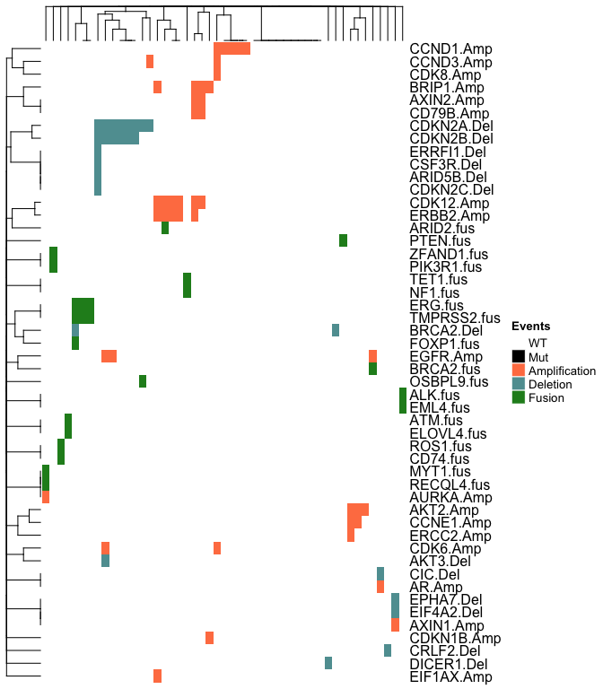

<!-- README.md is generated from README.Rmd. Please edit that file -->

# gnomeR

<!-- badges: start -->

[\[R-CMD-check\](https://github.com/MSKCC-Epi-Bio/gnomeR/workflows/R-CMD-check/badge.svg](https://github.com/MSKCC-Epi-Bio/gnomeR/actions)
[](https://app.codecov.io/gh/MSKCC-Epi-Bio/gnomeR?branch=main)
<!-- badges: end -->

<font size="5">:bangbang: :warning: **NOTE: This package is currently
under active development with a new stable release expected April 30th,
2022. For code written before 2022-03-23, please use the previous stable
version (v1.1.0)**:warning::bangbang: </font>

You can install the pre-2022-03-23 version with:

``` r
remotes::install_github('MSKCC-Epi-Bio/gnomeR@v1.1.0')
```

## Installation

You can install the development version of `gnomeR` from
[GitHub](https://github.com/) with:

``` r
# install.packages("devtools")
devtools::install_github("MSKCC-Epi-Bio/gnomeR")
```

Along with its companion package for cbioPortal data download:

``` r
devtools::install_github("karissawhiting/cbioportalr")
```

## Introduction

the `gnomeR` package provides a consistent framework for genetic data
processing, visualization and analysis. This is primarily targeted to
IMPACT datasets but can also be applied to any genomic data provided by
CbioPortal. With {gnomeR} and {cbioportalR} you can:

-   [**Download and gather data from
    CbioPortal**](https://github.com/karissawhiting/cbioportalR) - Pull
    from cBioPortal data base by study ID or sample ID.
-   **OncoKB annotate data** - Filter genomic data for known oncogenic
    alterations.
-   **Process genomic data** - Process retrieved mutation/maf, fusions,
    copy-number alteration, and segmentation data (when available) into
    an analysis-ready formats.
-   **Visualize processed data** - Create OncoPrints, heatmaps and
    summary plots from processed data.
-   **Analyzing processed data**- Analyze associations between genomic
    variables and clinical variables or outcomes with summary tables,
    advanced visualizations, and univariate models.

## Getting Set up

{gnomeR} works with any genomic data that follows cBioPortal guidelines
for
[mutation](https://docs.cbioportal.org/5.1-data-loading/data-loading/file-formats#data-file-5),
[CNA](https://docs.cbioportal.org/5.1-data-loading/data-loading/file-formats#discrete-copy-number-data),
or
[fusion](https://docs.cbioportal.org/5.1-data-loading/data-loading/file-formats#structural-variant-data)
data file formats.

If you wish to pull the data directly from CbioPortal, see how to get
set up with credentials with the
[{cBioPortalR}](https://karissawhiting.github.io/cbioportalR/) package.

If you want to oncoKB annotate your data, you need to acquire
credentials from the [oncoKB website](https://www.oncokb.org/apiAccess).

## Processing Genomic Data

The below examples uses the data sets `mut`, `fusion`, `cna` which were
pulled from cBioPortal and are included in the package as example data
sets. We will sample 100 samples for examples:

``` r
set.seed(123)

mut <- gnomeR::mut
cna <- gnomeR::cna
fusion <- gnomeR::fusion

un <-  unique(mut$Tumor_Sample_Barcode)
sample_patients <- sample(un, size = 100, replace = FALSE)
```

The main data processing function is `gene_binary()` which takes
mutation, CNA and fusion files as input, and outputs a binary matrix of
N rows (number of samples) by M genes included in the data set. We can
specify which patients are included which will force all patients in
resulting dataframe, even if they have no alterations.

``` r
gen_dat <- create_gene_binary(samples = sample_patients,
                         maf = mut,
                         fusion = fusion,
                         cna = cna, rm_empty = TRUE)

kable(gen_dat[1:5,1:5], row.names = TRUE)
```

|                   | OSBPL9.fus | ALK.fus | EML4.fus | MLL3.fus | BRCA2.fus |
|:------------------|-----------:|--------:|---------:|---------:|----------:|
| P-0010604-T01-IM5 |          0 |       0 |        0 |        1 |         0 |
| P-0002651-T01-IM3 |          0 |       0 |        0 |        0 |         0 |
| P-0000270-T01-IM3 |          0 |       0 |        0 |        0 |         0 |
| P-0002915-T01-IM3 |          0 |       0 |        0 |        0 |         0 |
| P-0011099-T01-IM5 |          0 |       0 |        0 |        0 |         0 |

## Visualize

You can visualize your processed and raw alteration data sets using
{gnomeR}’s many data visualization functions.

Quickly visualize mutation characteristics with `ggvarclass()`,
`ggvartype()`, `ggsnvclass()`, `ggsamplevar()`, `ggtopgenes()`,
`gggenecor()`, and `ggcomut()`.

``` r
ggvarclass(mutation = mut)
```


The wrapper function `mutation_viz()` will generate a list with the most
commonly used plot which you can pass into a plot assembly framework
like {patchwork}:

``` r
list_of_plots <- mutation_viz(mutation = mut)

patchwork::wrap_plots(list_of_plots, ncol = 2) & 
  ggplot2::theme(text = ggplot2::element_text(size = 8))
```


`ggheatmap()` allows you to visualize mutation, CNA and fusion data all
in one heatmap:

``` r
# filter only those with alterations
gen_dat <- gen_dat %>%
  rowwise() %>% 
  mutate(total_alterations = sum(c_across(everything()))) %>%
  filter(total_alterations > 1) %>%
  select(-total_alterations) %>%
  ungroup()

select_gen_dat <- gen_dat[, (purrr::map(gen_dat, ~sum(.x, na.rm = TRUE)) > 0)]

ggheatmap(select_gen_dat)
```



## Summarize & Analyze

You can tabulate summarize your genomic data frame using the
`tbl_genomic()` function, a wrapper for `gtsummary::tbl_summary()`.

``` r
gen_dat <- gen_dat %>%
  dplyr::mutate(trt_status = sample(x = c("pre-trt", "post-trt"),
       size = nrow(gen_dat), replace = TRUE)) 

gen_dat %>%
  tbl_genomic(freq_cutoff = .1, by = trt_status) %>%
  gtsummary::add_p() 
```

<div id="dlnsygvzig" style="overflow-x:auto;overflow-y:auto;width:auto;height:auto;">
<style>html {
  font-family: -apple-system, BlinkMacSystemFont, 'Segoe UI', Roboto, Oxygen, Ubuntu, Cantarell, 'Helvetica Neue', 'Fira Sans', 'Droid Sans', Arial, sans-serif;
}

#dlnsygvzig .gt_table {
  display: table;
  border-collapse: collapse;
  margin-left: auto;
  margin-right: auto;
  color: #333333;
  font-size: 16px;
  font-weight: normal;
  font-style: normal;
  background-color: #FFFFFF;
  width: auto;
  border-top-style: solid;
  border-top-width: 2px;
  border-top-color: #A8A8A8;
  border-right-style: none;
  border-right-width: 2px;
  border-right-color: #D3D3D3;
  border-bottom-style: solid;
  border-bottom-width: 2px;
  border-bottom-color: #A8A8A8;
  border-left-style: none;
  border-left-width: 2px;
  border-left-color: #D3D3D3;
}

#dlnsygvzig .gt_heading {
  background-color: #FFFFFF;
  text-align: center;
  border-bottom-color: #FFFFFF;
  border-left-style: none;
  border-left-width: 1px;
  border-left-color: #D3D3D3;
  border-right-style: none;
  border-right-width: 1px;
  border-right-color: #D3D3D3;
}

#dlnsygvzig .gt_title {
  color: #333333;
  font-size: 125%;
  font-weight: initial;
  padding-top: 4px;
  padding-bottom: 4px;
  padding-left: 5px;
  padding-right: 5px;
  border-bottom-color: #FFFFFF;
  border-bottom-width: 0;
}

#dlnsygvzig .gt_subtitle {
  color: #333333;
  font-size: 85%;
  font-weight: initial;
  padding-top: 0;
  padding-bottom: 6px;
  padding-left: 5px;
  padding-right: 5px;
  border-top-color: #FFFFFF;
  border-top-width: 0;
}

#dlnsygvzig .gt_bottom_border {
  border-bottom-style: solid;
  border-bottom-width: 2px;
  border-bottom-color: #D3D3D3;
}

#dlnsygvzig .gt_col_headings {
  border-top-style: solid;
  border-top-width: 2px;
  border-top-color: #D3D3D3;
  border-bottom-style: solid;
  border-bottom-width: 2px;
  border-bottom-color: #D3D3D3;
  border-left-style: none;
  border-left-width: 1px;
  border-left-color: #D3D3D3;
  border-right-style: none;
  border-right-width: 1px;
  border-right-color: #D3D3D3;
}

#dlnsygvzig .gt_col_heading {
  color: #333333;
  background-color: #FFFFFF;
  font-size: 100%;
  font-weight: normal;
  text-transform: inherit;
  border-left-style: none;
  border-left-width: 1px;
  border-left-color: #D3D3D3;
  border-right-style: none;
  border-right-width: 1px;
  border-right-color: #D3D3D3;
  vertical-align: bottom;
  padding-top: 5px;
  padding-bottom: 6px;
  padding-left: 5px;
  padding-right: 5px;
  overflow-x: hidden;
}

#dlnsygvzig .gt_column_spanner_outer {
  color: #333333;
  background-color: #FFFFFF;
  font-size: 100%;
  font-weight: normal;
  text-transform: inherit;
  padding-top: 0;
  padding-bottom: 0;
  padding-left: 4px;
  padding-right: 4px;
}

#dlnsygvzig .gt_column_spanner_outer:first-child {
  padding-left: 0;
}

#dlnsygvzig .gt_column_spanner_outer:last-child {
  padding-right: 0;
}

#dlnsygvzig .gt_column_spanner {
  border-bottom-style: solid;
  border-bottom-width: 2px;
  border-bottom-color: #D3D3D3;
  vertical-align: bottom;
  padding-top: 5px;
  padding-bottom: 5px;
  overflow-x: hidden;
  display: inline-block;
  width: 100%;
}

#dlnsygvzig .gt_group_heading {
  padding-top: 8px;
  padding-bottom: 8px;
  padding-left: 5px;
  padding-right: 5px;
  color: #333333;
  background-color: #FFFFFF;
  font-size: 100%;
  font-weight: initial;
  text-transform: inherit;
  border-top-style: solid;
  border-top-width: 2px;
  border-top-color: #D3D3D3;
  border-bottom-style: solid;
  border-bottom-width: 2px;
  border-bottom-color: #D3D3D3;
  border-left-style: none;
  border-left-width: 1px;
  border-left-color: #D3D3D3;
  border-right-style: none;
  border-right-width: 1px;
  border-right-color: #D3D3D3;
  vertical-align: middle;
}

#dlnsygvzig .gt_empty_group_heading {
  padding: 0.5px;
  color: #333333;
  background-color: #FFFFFF;
  font-size: 100%;
  font-weight: initial;
  border-top-style: solid;
  border-top-width: 2px;
  border-top-color: #D3D3D3;
  border-bottom-style: solid;
  border-bottom-width: 2px;
  border-bottom-color: #D3D3D3;
  vertical-align: middle;
}

#dlnsygvzig .gt_from_md > :first-child {
  margin-top: 0;
}

#dlnsygvzig .gt_from_md > :last-child {
  margin-bottom: 0;
}

#dlnsygvzig .gt_row {
  padding-top: 8px;
  padding-bottom: 8px;
  padding-left: 5px;
  padding-right: 5px;
  margin: 10px;
  border-top-style: solid;
  border-top-width: 1px;
  border-top-color: #D3D3D3;
  border-left-style: none;
  border-left-width: 1px;
  border-left-color: #D3D3D3;
  border-right-style: none;
  border-right-width: 1px;
  border-right-color: #D3D3D3;
  vertical-align: middle;
  overflow-x: hidden;
}

#dlnsygvzig .gt_stub {
  color: #333333;
  background-color: #FFFFFF;
  font-size: 100%;
  font-weight: initial;
  text-transform: inherit;
  border-right-style: solid;
  border-right-width: 2px;
  border-right-color: #D3D3D3;
  padding-left: 5px;
  padding-right: 5px;
}

#dlnsygvzig .gt_stub_row_group {
  color: #333333;
  background-color: #FFFFFF;
  font-size: 100%;
  font-weight: initial;
  text-transform: inherit;
  border-right-style: solid;
  border-right-width: 2px;
  border-right-color: #D3D3D3;
  padding-left: 5px;
  padding-right: 5px;
  vertical-align: top;
}

#dlnsygvzig .gt_row_group_first td {
  border-top-width: 2px;
}

#dlnsygvzig .gt_summary_row {
  color: #333333;
  background-color: #FFFFFF;
  text-transform: inherit;
  padding-top: 8px;
  padding-bottom: 8px;
  padding-left: 5px;
  padding-right: 5px;
}

#dlnsygvzig .gt_first_summary_row {
  border-top-style: solid;
  border-top-color: #D3D3D3;
}

#dlnsygvzig .gt_first_summary_row.thick {
  border-top-width: 2px;
}

#dlnsygvzig .gt_last_summary_row {
  padding-top: 8px;
  padding-bottom: 8px;
  padding-left: 5px;
  padding-right: 5px;
  border-bottom-style: solid;
  border-bottom-width: 2px;
  border-bottom-color: #D3D3D3;
}

#dlnsygvzig .gt_grand_summary_row {
  color: #333333;
  background-color: #FFFFFF;
  text-transform: inherit;
  padding-top: 8px;
  padding-bottom: 8px;
  padding-left: 5px;
  padding-right: 5px;
}

#dlnsygvzig .gt_first_grand_summary_row {
  padding-top: 8px;
  padding-bottom: 8px;
  padding-left: 5px;
  padding-right: 5px;
  border-top-style: double;
  border-top-width: 6px;
  border-top-color: #D3D3D3;
}

#dlnsygvzig .gt_striped {
  background-color: rgba(128, 128, 128, 0.05);
}

#dlnsygvzig .gt_table_body {
  border-top-style: solid;
  border-top-width: 2px;
  border-top-color: #D3D3D3;
  border-bottom-style: solid;
  border-bottom-width: 2px;
  border-bottom-color: #D3D3D3;
}

#dlnsygvzig .gt_footnotes {
  color: #333333;
  background-color: #FFFFFF;
  border-bottom-style: none;
  border-bottom-width: 2px;
  border-bottom-color: #D3D3D3;
  border-left-style: none;
  border-left-width: 2px;
  border-left-color: #D3D3D3;
  border-right-style: none;
  border-right-width: 2px;
  border-right-color: #D3D3D3;
}

#dlnsygvzig .gt_footnote {
  margin: 0px;
  font-size: 90%;
  padding-left: 4px;
  padding-right: 4px;
  padding-left: 5px;
  padding-right: 5px;
}

#dlnsygvzig .gt_sourcenotes {
  color: #333333;
  background-color: #FFFFFF;
  border-bottom-style: none;
  border-bottom-width: 2px;
  border-bottom-color: #D3D3D3;
  border-left-style: none;
  border-left-width: 2px;
  border-left-color: #D3D3D3;
  border-right-style: none;
  border-right-width: 2px;
  border-right-color: #D3D3D3;
}

#dlnsygvzig .gt_sourcenote {
  font-size: 90%;
  padding-top: 4px;
  padding-bottom: 4px;
  padding-left: 5px;
  padding-right: 5px;
}

#dlnsygvzig .gt_left {
  text-align: left;
}

#dlnsygvzig .gt_center {
  text-align: center;
}

#dlnsygvzig .gt_right {
  text-align: right;
  font-variant-numeric: tabular-nums;
}

#dlnsygvzig .gt_font_normal {
  font-weight: normal;
}

#dlnsygvzig .gt_font_bold {
  font-weight: bold;
}

#dlnsygvzig .gt_font_italic {
  font-style: italic;
}

#dlnsygvzig .gt_super {
  font-size: 65%;
}

#dlnsygvzig .gt_footnote_marks {
  font-style: italic;
  font-weight: normal;
  font-size: 75%;
  vertical-align: 0.4em;
}

#dlnsygvzig .gt_asterisk {
  font-size: 100%;
  vertical-align: 0;
}

#dlnsygvzig .gt_slash_mark {
  font-size: 0.7em;
  line-height: 0.7em;
  vertical-align: 0.15em;
}

#dlnsygvzig .gt_fraction_numerator {
  font-size: 0.6em;
  line-height: 0.6em;
  vertical-align: 0.45em;
}

#dlnsygvzig .gt_fraction_denominator {
  font-size: 0.6em;
  line-height: 0.6em;
  vertical-align: -0.05em;
}
</style>
<table class="gt_table">
  
  <thead class="gt_col_headings">
    <tr>
      <th class="gt_col_heading gt_columns_bottom_border gt_left" rowspan="1" colspan="1"><strong>Characteristic</strong></th>
      <th class="gt_col_heading gt_columns_bottom_border gt_center" rowspan="1" colspan="1"><strong>Overall</strong>, N = 49<sup class="gt_footnote_marks">1</sup></th>
      <th class="gt_col_heading gt_columns_bottom_border gt_center" rowspan="1" colspan="1"><strong>post-trt</strong>, N = 27<sup class="gt_footnote_marks">1</sup></th>
      <th class="gt_col_heading gt_columns_bottom_border gt_center" rowspan="1" colspan="1"><strong>pre-trt</strong>, N = 22<sup class="gt_footnote_marks">1</sup></th>
      <th class="gt_col_heading gt_columns_bottom_border gt_center" rowspan="1" colspan="1"><strong>p-value</strong><sup class="gt_footnote_marks">2</sup></th>
    </tr>
  </thead>
  <tbody class="gt_table_body">
    <tr><td class="gt_row gt_left" style="font-weight: bold;">CDK12.Amp</td>
<td class="gt_row gt_center">6 (12%)</td>
<td class="gt_row gt_center">3 (11%)</td>
<td class="gt_row gt_center">3 (14%)</td>
<td class="gt_row gt_center">>0.9</td></tr>
    <tr><td class="gt_row gt_left" style="font-weight: bold;">MCL1.Amp</td>
<td class="gt_row gt_center">6 (12%)</td>
<td class="gt_row gt_center">3 (11%)</td>
<td class="gt_row gt_center">3 (14%)</td>
<td class="gt_row gt_center">>0.9</td></tr>
    <tr><td class="gt_row gt_left" style="font-weight: bold;">MYC.Amp</td>
<td class="gt_row gt_center">6 (12%)</td>
<td class="gt_row gt_center">4 (15%)</td>
<td class="gt_row gt_center">2 (9.1%)</td>
<td class="gt_row gt_center">0.7</td></tr>
    <tr><td class="gt_row gt_left" style="font-weight: bold;">CCND1.Amp</td>
<td class="gt_row gt_center">5 (10%)</td>
<td class="gt_row gt_center">1 (3.7%)</td>
<td class="gt_row gt_center">4 (18%)</td>
<td class="gt_row gt_center">0.2</td></tr>
    <tr><td class="gt_row gt_left" style="font-weight: bold;">ERBB2.Amp</td>
<td class="gt_row gt_center">5 (10%)</td>
<td class="gt_row gt_center">3 (11%)</td>
<td class="gt_row gt_center">2 (9.1%)</td>
<td class="gt_row gt_center">>0.9</td></tr>
    <tr><td class="gt_row gt_left" style="font-weight: bold;">FGF19.Amp</td>
<td class="gt_row gt_center">5 (10%)</td>
<td class="gt_row gt_center">1 (3.7%)</td>
<td class="gt_row gt_center">4 (18%)</td>
<td class="gt_row gt_center">0.2</td></tr>
    <tr><td class="gt_row gt_left" style="font-weight: bold;">CDKN2A.Del</td>
<td class="gt_row gt_center">8 (16%)</td>
<td class="gt_row gt_center">4 (15%)</td>
<td class="gt_row gt_center">4 (18%)</td>
<td class="gt_row gt_center">>0.9</td></tr>
    <tr><td class="gt_row gt_left" style="font-weight: bold;">CDKN2B.Del</td>
<td class="gt_row gt_center">6 (12%)</td>
<td class="gt_row gt_center">3 (11%)</td>
<td class="gt_row gt_center">3 (14%)</td>
<td class="gt_row gt_center">>0.9</td></tr>
    <tr><td class="gt_row gt_left" style="font-weight: bold;">PTEN.Del</td>
<td class="gt_row gt_center">4 (8.2%)</td>
<td class="gt_row gt_center">2 (7.4%)</td>
<td class="gt_row gt_center">2 (9.1%)</td>
<td class="gt_row gt_center">>0.9</td></tr>
    <tr><td class="gt_row gt_left" style="font-weight: bold;">PTEN.fus</td>
<td class="gt_row gt_center">1 (2.0%)</td>
<td class="gt_row gt_center">1 (3.7%)</td>
<td class="gt_row gt_center">0 (0%)</td>
<td class="gt_row gt_center">>0.9</td></tr>
  </tbody>
  
  <tfoot class="gt_footnotes">
    <tr>
      <td class="gt_footnote" colspan="5"><sup class="gt_footnote_marks">1</sup> n (%)</td>
    </tr>
    <tr>
      <td class="gt_footnote" colspan="5"><sup class="gt_footnote_marks">2</sup> Fisher's exact test</td>
    </tr>
  </tfoot>
</table>
</div>

Additionally, you can analyze custom pathways, or a set of default gene
pathways using `add_pathways()`:

``` r
gen_dat %>%
  add_pathways() %>%
  select(trt_status, contains("pathway_")) %>%
  tbl_genomic(by = trt_status) %>%
  gtsummary::add_p()
```

<div id="bpmsxtogda" style="overflow-x:auto;overflow-y:auto;width:auto;height:auto;">
<style>html {
  font-family: -apple-system, BlinkMacSystemFont, 'Segoe UI', Roboto, Oxygen, Ubuntu, Cantarell, 'Helvetica Neue', 'Fira Sans', 'Droid Sans', Arial, sans-serif;
}

#bpmsxtogda .gt_table {
  display: table;
  border-collapse: collapse;
  margin-left: auto;
  margin-right: auto;
  color: #333333;
  font-size: 16px;
  font-weight: normal;
  font-style: normal;
  background-color: #FFFFFF;
  width: auto;
  border-top-style: solid;
  border-top-width: 2px;
  border-top-color: #A8A8A8;
  border-right-style: none;
  border-right-width: 2px;
  border-right-color: #D3D3D3;
  border-bottom-style: solid;
  border-bottom-width: 2px;
  border-bottom-color: #A8A8A8;
  border-left-style: none;
  border-left-width: 2px;
  border-left-color: #D3D3D3;
}

#bpmsxtogda .gt_heading {
  background-color: #FFFFFF;
  text-align: center;
  border-bottom-color: #FFFFFF;
  border-left-style: none;
  border-left-width: 1px;
  border-left-color: #D3D3D3;
  border-right-style: none;
  border-right-width: 1px;
  border-right-color: #D3D3D3;
}

#bpmsxtogda .gt_title {
  color: #333333;
  font-size: 125%;
  font-weight: initial;
  padding-top: 4px;
  padding-bottom: 4px;
  padding-left: 5px;
  padding-right: 5px;
  border-bottom-color: #FFFFFF;
  border-bottom-width: 0;
}

#bpmsxtogda .gt_subtitle {
  color: #333333;
  font-size: 85%;
  font-weight: initial;
  padding-top: 0;
  padding-bottom: 6px;
  padding-left: 5px;
  padding-right: 5px;
  border-top-color: #FFFFFF;
  border-top-width: 0;
}

#bpmsxtogda .gt_bottom_border {
  border-bottom-style: solid;
  border-bottom-width: 2px;
  border-bottom-color: #D3D3D3;
}

#bpmsxtogda .gt_col_headings {
  border-top-style: solid;
  border-top-width: 2px;
  border-top-color: #D3D3D3;
  border-bottom-style: solid;
  border-bottom-width: 2px;
  border-bottom-color: #D3D3D3;
  border-left-style: none;
  border-left-width: 1px;
  border-left-color: #D3D3D3;
  border-right-style: none;
  border-right-width: 1px;
  border-right-color: #D3D3D3;
}

#bpmsxtogda .gt_col_heading {
  color: #333333;
  background-color: #FFFFFF;
  font-size: 100%;
  font-weight: normal;
  text-transform: inherit;
  border-left-style: none;
  border-left-width: 1px;
  border-left-color: #D3D3D3;
  border-right-style: none;
  border-right-width: 1px;
  border-right-color: #D3D3D3;
  vertical-align: bottom;
  padding-top: 5px;
  padding-bottom: 6px;
  padding-left: 5px;
  padding-right: 5px;
  overflow-x: hidden;
}

#bpmsxtogda .gt_column_spanner_outer {
  color: #333333;
  background-color: #FFFFFF;
  font-size: 100%;
  font-weight: normal;
  text-transform: inherit;
  padding-top: 0;
  padding-bottom: 0;
  padding-left: 4px;
  padding-right: 4px;
}

#bpmsxtogda .gt_column_spanner_outer:first-child {
  padding-left: 0;
}

#bpmsxtogda .gt_column_spanner_outer:last-child {
  padding-right: 0;
}

#bpmsxtogda .gt_column_spanner {
  border-bottom-style: solid;
  border-bottom-width: 2px;
  border-bottom-color: #D3D3D3;
  vertical-align: bottom;
  padding-top: 5px;
  padding-bottom: 5px;
  overflow-x: hidden;
  display: inline-block;
  width: 100%;
}

#bpmsxtogda .gt_group_heading {
  padding-top: 8px;
  padding-bottom: 8px;
  padding-left: 5px;
  padding-right: 5px;
  color: #333333;
  background-color: #FFFFFF;
  font-size: 100%;
  font-weight: initial;
  text-transform: inherit;
  border-top-style: solid;
  border-top-width: 2px;
  border-top-color: #D3D3D3;
  border-bottom-style: solid;
  border-bottom-width: 2px;
  border-bottom-color: #D3D3D3;
  border-left-style: none;
  border-left-width: 1px;
  border-left-color: #D3D3D3;
  border-right-style: none;
  border-right-width: 1px;
  border-right-color: #D3D3D3;
  vertical-align: middle;
}

#bpmsxtogda .gt_empty_group_heading {
  padding: 0.5px;
  color: #333333;
  background-color: #FFFFFF;
  font-size: 100%;
  font-weight: initial;
  border-top-style: solid;
  border-top-width: 2px;
  border-top-color: #D3D3D3;
  border-bottom-style: solid;
  border-bottom-width: 2px;
  border-bottom-color: #D3D3D3;
  vertical-align: middle;
}

#bpmsxtogda .gt_from_md > :first-child {
  margin-top: 0;
}

#bpmsxtogda .gt_from_md > :last-child {
  margin-bottom: 0;
}

#bpmsxtogda .gt_row {
  padding-top: 8px;
  padding-bottom: 8px;
  padding-left: 5px;
  padding-right: 5px;
  margin: 10px;
  border-top-style: solid;
  border-top-width: 1px;
  border-top-color: #D3D3D3;
  border-left-style: none;
  border-left-width: 1px;
  border-left-color: #D3D3D3;
  border-right-style: none;
  border-right-width: 1px;
  border-right-color: #D3D3D3;
  vertical-align: middle;
  overflow-x: hidden;
}

#bpmsxtogda .gt_stub {
  color: #333333;
  background-color: #FFFFFF;
  font-size: 100%;
  font-weight: initial;
  text-transform: inherit;
  border-right-style: solid;
  border-right-width: 2px;
  border-right-color: #D3D3D3;
  padding-left: 5px;
  padding-right: 5px;
}

#bpmsxtogda .gt_stub_row_group {
  color: #333333;
  background-color: #FFFFFF;
  font-size: 100%;
  font-weight: initial;
  text-transform: inherit;
  border-right-style: solid;
  border-right-width: 2px;
  border-right-color: #D3D3D3;
  padding-left: 5px;
  padding-right: 5px;
  vertical-align: top;
}

#bpmsxtogda .gt_row_group_first td {
  border-top-width: 2px;
}

#bpmsxtogda .gt_summary_row {
  color: #333333;
  background-color: #FFFFFF;
  text-transform: inherit;
  padding-top: 8px;
  padding-bottom: 8px;
  padding-left: 5px;
  padding-right: 5px;
}

#bpmsxtogda .gt_first_summary_row {
  border-top-style: solid;
  border-top-color: #D3D3D3;
}

#bpmsxtogda .gt_first_summary_row.thick {
  border-top-width: 2px;
}

#bpmsxtogda .gt_last_summary_row {
  padding-top: 8px;
  padding-bottom: 8px;
  padding-left: 5px;
  padding-right: 5px;
  border-bottom-style: solid;
  border-bottom-width: 2px;
  border-bottom-color: #D3D3D3;
}

#bpmsxtogda .gt_grand_summary_row {
  color: #333333;
  background-color: #FFFFFF;
  text-transform: inherit;
  padding-top: 8px;
  padding-bottom: 8px;
  padding-left: 5px;
  padding-right: 5px;
}

#bpmsxtogda .gt_first_grand_summary_row {
  padding-top: 8px;
  padding-bottom: 8px;
  padding-left: 5px;
  padding-right: 5px;
  border-top-style: double;
  border-top-width: 6px;
  border-top-color: #D3D3D3;
}

#bpmsxtogda .gt_striped {
  background-color: rgba(128, 128, 128, 0.05);
}

#bpmsxtogda .gt_table_body {
  border-top-style: solid;
  border-top-width: 2px;
  border-top-color: #D3D3D3;
  border-bottom-style: solid;
  border-bottom-width: 2px;
  border-bottom-color: #D3D3D3;
}

#bpmsxtogda .gt_footnotes {
  color: #333333;
  background-color: #FFFFFF;
  border-bottom-style: none;
  border-bottom-width: 2px;
  border-bottom-color: #D3D3D3;
  border-left-style: none;
  border-left-width: 2px;
  border-left-color: #D3D3D3;
  border-right-style: none;
  border-right-width: 2px;
  border-right-color: #D3D3D3;
}

#bpmsxtogda .gt_footnote {
  margin: 0px;
  font-size: 90%;
  padding-left: 4px;
  padding-right: 4px;
  padding-left: 5px;
  padding-right: 5px;
}

#bpmsxtogda .gt_sourcenotes {
  color: #333333;
  background-color: #FFFFFF;
  border-bottom-style: none;
  border-bottom-width: 2px;
  border-bottom-color: #D3D3D3;
  border-left-style: none;
  border-left-width: 2px;
  border-left-color: #D3D3D3;
  border-right-style: none;
  border-right-width: 2px;
  border-right-color: #D3D3D3;
}

#bpmsxtogda .gt_sourcenote {
  font-size: 90%;
  padding-top: 4px;
  padding-bottom: 4px;
  padding-left: 5px;
  padding-right: 5px;
}

#bpmsxtogda .gt_left {
  text-align: left;
}

#bpmsxtogda .gt_center {
  text-align: center;
}

#bpmsxtogda .gt_right {
  text-align: right;
  font-variant-numeric: tabular-nums;
}

#bpmsxtogda .gt_font_normal {
  font-weight: normal;
}

#bpmsxtogda .gt_font_bold {
  font-weight: bold;
}

#bpmsxtogda .gt_font_italic {
  font-style: italic;
}

#bpmsxtogda .gt_super {
  font-size: 65%;
}

#bpmsxtogda .gt_footnote_marks {
  font-style: italic;
  font-weight: normal;
  font-size: 75%;
  vertical-align: 0.4em;
}

#bpmsxtogda .gt_asterisk {
  font-size: 100%;
  vertical-align: 0;
}

#bpmsxtogda .gt_slash_mark {
  font-size: 0.7em;
  line-height: 0.7em;
  vertical-align: 0.15em;
}

#bpmsxtogda .gt_fraction_numerator {
  font-size: 0.6em;
  line-height: 0.6em;
  vertical-align: 0.45em;
}

#bpmsxtogda .gt_fraction_denominator {
  font-size: 0.6em;
  line-height: 0.6em;
  vertical-align: -0.05em;
}
</style>
<table class="gt_table">
  
  <thead class="gt_col_headings">
    <tr>
      <th class="gt_col_heading gt_columns_bottom_border gt_left" rowspan="1" colspan="1"><strong>Characteristic</strong></th>
      <th class="gt_col_heading gt_columns_bottom_border gt_center" rowspan="1" colspan="1"><strong>Overall</strong>, N = 49<sup class="gt_footnote_marks">1</sup></th>
      <th class="gt_col_heading gt_columns_bottom_border gt_center" rowspan="1" colspan="1"><strong>post-trt</strong>, N = 27<sup class="gt_footnote_marks">1</sup></th>
      <th class="gt_col_heading gt_columns_bottom_border gt_center" rowspan="1" colspan="1"><strong>pre-trt</strong>, N = 22<sup class="gt_footnote_marks">1</sup></th>
      <th class="gt_col_heading gt_columns_bottom_border gt_center" rowspan="1" colspan="1"><strong>p-value</strong><sup class="gt_footnote_marks">2</sup></th>
    </tr>
  </thead>
  <tbody class="gt_table_body">
    <tr><td class="gt_row gt_left" style="font-weight: bold;">pathway_Myc</td>
<td class="gt_row gt_center">6 (12%)</td>
<td class="gt_row gt_center">4 (15%)</td>
<td class="gt_row gt_center">2 (9.1%)</td>
<td class="gt_row gt_center">0.7</td></tr>
    <tr><td class="gt_row gt_left" style="font-weight: bold;">pathway_PI3K</td>
<td class="gt_row gt_center">4 (8.2%)</td>
<td class="gt_row gt_center">2 (7.4%)</td>
<td class="gt_row gt_center">2 (9.1%)</td>
<td class="gt_row gt_center">>0.9</td></tr>
    <tr><td class="gt_row gt_left" style="font-weight: bold;">pathway_RTK/RAS</td>
<td class="gt_row gt_center">3 (6.1%)</td>
<td class="gt_row gt_center">1 (3.7%)</td>
<td class="gt_row gt_center">2 (9.1%)</td>
<td class="gt_row gt_center">0.6</td></tr>
    <tr><td class="gt_row gt_left" style="font-weight: bold;">pathway_Nrf2</td>
<td class="gt_row gt_center">1 (2.0%)</td>
<td class="gt_row gt_center">1 (3.7%)</td>
<td class="gt_row gt_center">0 (0%)</td>
<td class="gt_row gt_center">>0.9</td></tr>
    <tr><td class="gt_row gt_left" style="font-weight: bold;">pathway_p53</td>
<td class="gt_row gt_center">1 (2.0%)</td>
<td class="gt_row gt_center">1 (3.7%)</td>
<td class="gt_row gt_center">0 (0%)</td>
<td class="gt_row gt_center">>0.9</td></tr>
    <tr><td class="gt_row gt_left" style="font-weight: bold;">pathway_Cell cycle</td>
<td class="gt_row gt_center">0 (0%)</td>
<td class="gt_row gt_center">0 (0%)</td>
<td class="gt_row gt_center">0 (0%)</td>
<td class="gt_row gt_center"></td></tr>
    <tr><td class="gt_row gt_left" style="font-weight: bold;">pathway_Hippo</td>
<td class="gt_row gt_center">0 (0%)</td>
<td class="gt_row gt_center">0 (0%)</td>
<td class="gt_row gt_center">0 (0%)</td>
<td class="gt_row gt_center"></td></tr>
    <tr><td class="gt_row gt_left" style="font-weight: bold;">pathway_Notch</td>
<td class="gt_row gt_center">0 (0%)</td>
<td class="gt_row gt_center">0 (0%)</td>
<td class="gt_row gt_center">0 (0%)</td>
<td class="gt_row gt_center"></td></tr>
    <tr><td class="gt_row gt_left" style="font-weight: bold;">pathway_TGFB</td>
<td class="gt_row gt_center">0 (0%)</td>
<td class="gt_row gt_center">0 (0%)</td>
<td class="gt_row gt_center">0 (0%)</td>
<td class="gt_row gt_center"></td></tr>
    <tr><td class="gt_row gt_left" style="font-weight: bold;">pathway_Wnt</td>
<td class="gt_row gt_center">0 (0%)</td>
<td class="gt_row gt_center">0 (0%)</td>
<td class="gt_row gt_center">0 (0%)</td>
<td class="gt_row gt_center"></td></tr>
  </tbody>
  
  <tfoot class="gt_footnotes">
    <tr>
      <td class="gt_footnote" colspan="5"><sup class="gt_footnote_marks">1</sup> n (%)</td>
    </tr>
    <tr>
      <td class="gt_footnote" colspan="5"><sup class="gt_footnote_marks">2</sup> Fisher's exact test</td>
    </tr>
  </tfoot>
</table>
</div>

## Further analytical tools

Along with mutation, cna and fusion data, {gnomeR} also allows analysis
and visualization of
[FACETs](https://www.ncbi.nlm.nih.gov/pmc/articles/PMC5027494/) data.
[FACETs](https://www.ncbi.nlm.nih.gov/pmc/articles/PMC5027494/) is an
allele-specific copy number tool and open-source software with a broad
application to whole genome, whole-exome, as well as targeted panel
sequencing platforms. It is a fully integrated stand-alone pipeline that
includes sequencing BAM file post-processing, joint segmentation of
total- and allele-specific read counts, and integer copy number calls
corrected for tumor purity, ploidy and clonal heterogeneity, with
comprehensive output.

You can vizualize this data using `facets_heatmap()`

``` r
select_samples <- sample(unique(seg$ID),  100)
p.heat <- facets_heatmap(seg = seg, samples = select_samples, min_purity = 0)
p.heat$p
```

The primary goal of `gnomeR` not being in depth analysis of genomic data
but rather reliable, modular and reproducible framework for processing
various types of genomic data. For users interested in large scale
genomic analytical methods we compiled various packages developed by
[Department of Epidemiology and
Biostatistics](https://www.mskcc.org/departments/epidemiology-biostatistics),
Memorial Sloan-Kettering Cancer Center under an umbrella R package,
[gnomeVerse](https://github.com/AxelitoMartin/genomeVerse).

# Contributing

Please note that the gnomeR project is released with a [Contributor Code
of
Conduct](https://contributor-covenant.org/version/2/0/CODE_OF_CONDUCT.html).
By contributing to this project, you agree to abide by its terms.

[@akriti21](https://github.com/akriti21),
[@carokos](https://github.com/carokos),
[@ChristineZ-msk](https://github.com/ChristineZ-msk),
[@jflynn264](https://github.com/jflynn264),
[@karissawhiting](https://github.com/karissawhiting), and
[@michaelcurry1123](https://github.com/michaelcurry1123)
