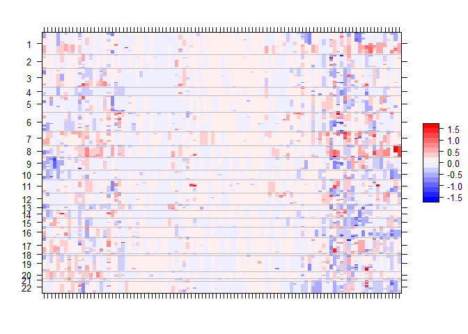

<!-- README.md is generated from README.Rmd. Please edit that file -->

# gnomeR

<!-- badges: start -->

[](https://travis-ci.org/AxelitoMartin/gnomeR)
[](https://codecov.io/gh/AxelitoMartin/gnomeR?branch=development)
<!-- badges: end -->

the `gnomeR` package provides a consistent framework for genetic data
processing, visualization and analysis. This is primarily targeted to
IMPACT datasets but can also be applied to any genomic data provided by
CbioPortal.

  - [**Dowloading and gathering data from
    CbioPortal**](https://github.com/karissawhiting/cbioportalr) through
    an integrated API using simply the sample IDs of the samples of
    interests or the name of the study to retrive all samples in that
    study. A separate package `cbioportalr` was developed independently.
  - [**Processing genomic
    data**](https://axelitomartin.github.io/gnomeR/articles/Data-processing.html)
    retrieved for mutations (MAF file), fusions (MAF file) and
    copy-number alterations (and when available segmentation files) into
    an analysis ready format.
  - [**Visualization of the processed
    data**](https://axelitomartin.github.io/gnomeR/articles/Visualizations.html)
    provided through MAF file summaries, OncoPrints and heatmaps.
  - [**Analyzing the processed
    data**](https://axelitomartin.github.io/gnomeR/articles/Analizing-genomic-data.html)
    for association with binary, continuous and survival outcome.
    Including further visualiztion to improve understanding of the
    results.

## Installation

You can install `gnomeR` from [GitHub](https://github.com/) with:

``` r
# install.packages("devtools")
devtools::install_github("AxelitoMartin/gnomeR")
```

Similarly for those who wish to explore the development version of
`gnomeR`:

``` r
devtools::install_github("AxelitoMartin/gnomeR", ref = "development")
```

Along with its companion package for cbioPortal data download:

NOTE: This package is currently in a private repo. Please contact whitingk@mskcc.org for access. 

``` r
devtools::install_github("karissawhiting/cbioportalr")
```

## Examples

### Setting up the API

In order to download the data from CbioPortal, one must first require a
token from the website [CbioPortal](https://cbioportal.mskcc.org/) wich
will prompt a login page with your MSKCC credentials. Then navigate to
“Web API” in the top bar menu, following this simply download a token
and copy it after running the following command in R:

``` r
usethis::edit_r_environ()
```

And pasting the token you were given in the .Renviron file that was
created and saving after pasting your token.

``` r
CBIOPORTAL_TOKEN = 'YOUR_TOKEN'
```

You can test your connection using:

``` r
get_cbioportal_token()
```

### Retrieving data

Now that the Cbioportal API is set up in your environment, you must
first specify the database of interest (IMPACT or TCGA are the two
available options). Following this one can either sepcify the samples or
study of interest:

``` r
library(gnomeR)
library(cbioportalr)
ids <- as.character(unique(mut$Tumor_Sample_Barcode)[1:100])
df <- get_genetics(sample_ids = ids,database = "msk_impact",
                       mutations = TRUE, fusions = TRUE, cna = TRUE)
```

### Processing the downloaded data

The `binmat()` function is the feature of the data processing of
`gnomeR`. It takes genomic inputs from various sources of CbioPortal
(mutation files, fusion files and copy number raw counts) to give out a
clean binary matrix of n samples by all the events that were found in
the files.

``` r
df.clean <- binmat(maf = df$mut, cna = df$cna)
```

We further included example datasets from the raw dowloaded files on
CbioPortal (`mut`, `fusion`, `cna`) which we will use for the following
examples.

``` r
set.seed(123)
patients <- as.character(unique(mut$Tumor_Sample_Barcode))[sample(1:length(unique(mut$Tumor_Sample_Barcode)), 100, replace=FALSE)]

gen.dat <- binmat(patients = patients, maf = mut, fusion = fusion, cna = cna)
kable(gen.dat[1:10,1:10],row.names = TRUE)
```

|                   | TP53 | IGF1R | KEAP1 | KDM5C | KRAS | TERT | MAP2K1 | NCOR1 | DDR2 | FIP1L1 |
| :---------------- | ---: | ----: | ----: | ----: | ---: | ---: | -----: | ----: | ---: | -----: |
| P-0010604-T01-IM5 |    1 |     0 |     0 |     0 |    0 |    0 |      0 |     0 |    0 |      0 |
| P-0002651-T01-IM3 |    1 |     0 |     0 |     0 |    0 |    0 |      0 |     0 |    0 |      0 |
| P-0000270-T01-IM3 |    1 |     0 |     0 |     0 |    0 |    0 |      0 |     0 |    0 |      0 |
| P-0002915-T01-IM3 |    0 |     0 |     0 |     0 |    0 |    0 |      0 |     0 |    0 |      0 |
| P-0011099-T01-IM5 |    0 |     0 |     0 |     0 |    0 |    0 |      0 |     0 |    0 |      0 |
| P-0000080-T01-IM3 |    1 |     0 |     0 |     0 |    0 |    0 |      0 |     0 |    0 |      0 |
| P-0001741-T01-IM3 |    1 |     0 |     1 |     0 |    1 |    0 |      0 |     0 |    0 |      0 |
| P-0003964-T01-IM3 |    0 |     0 |     1 |     0 |    1 |    0 |      0 |     0 |    0 |      0 |
| P-0003842-T01-IM5 |    0 |     0 |     0 |     0 |    0 |    0 |      0 |     0 |    0 |      0 |
| P-0002597-T02-IM5 |    0 |     0 |     0 |     0 |    0 |    0 |      0 |     0 |    0 |      0 |

### Visualization

#### MAF

Before we move on to more complex visualizations, we integrate the
`maf_viz()` function to give an overview of the distribution of the
different mutations across the cohort of interest:

``` r
sum.plots <- maf_viz(maf = mut %>% filter(Tumor_Sample_Barcode %in% patients))
sum.plots$topgenes
```


``` r
sum.plots$genecomut
```


#### OncoPrints

OncoPrints are a convenient way to display the overall genomic profiles
of samples in the cohort of interest. This is best used for a subset of
genes that are under consideration.

``` r
genes <- c("TP53","PIK3CA","KRAS","TERT","EGFR","FAT","ALK","CDKN2A","CDKN2B")
plot_oncoPrint(gen.dat = gen.dat %>% select(starts_with(genes)))
```


#### FACETs

[FACETs](https://www.ncbi.nlm.nih.gov/pmc/articles/PMC5027494/) is an
ASCN tool and open-source software with a broad application to whole
genome, whole-exome, as well as targeted panel sequencing platforms. It
is a fully integrated stand-alone pipeline that includes sequencing BAM
file post-processing, joint segmentation of total- and allele-specific
read counts, and integer copy number calls corrected for tumor purity,
ploidy and clonal heterogeneity, with comprehensive output.

``` r
p.heat <- facets.heatmap(seg = seg, patients = patients, min.purity = 0)
p.heat$p
```



### Analysis

In this section we will quickly overview the possible analysis in
gnomeR.

#### Binary and continuous outcomes

The `gen.summary()` function let’s the user perform a large scale
association between the genomic features present in the `binmat()`
function output and an outcome of choice:

  - binary (unpaired test using Fisher’s exact test and paired test
    using McNemmar’s exact test)
  - continuous (using simple linear regression)

<!-- end list -->

``` r
outcome <- factor(rbinom(n = length(patients),size = 1,prob = 1/2),levels = c("0","1"))
out <- gen.summary(gen.dat = gen.dat,outcome = outcome,filter = 0.05)
kable(out$fits[1:10,],row.names = TRUE)
```

|           | Feature   | Overall | 0(N=50) | 1(N=50) | OddsRatio | Pvalue   | FDR      | Lower | Upper |
| :-------- | :-------- | :------ | :------ | :------ | :-------- | :------- | :------- | :---- | :---- |
| MYC.Amp   | MYC.Amp   | 6%      | 10%     | 2%      | 0.19      | 2.04e-01 | 1.00e+00 | 0     | 1.76  |
| PIK3CA    | PIK3CA    | 12%     | 8%      | 16%     | 2.17      | 3.57e-01 | 1.00e+00 | 0.53  | 10.6  |
| EPHA5     | EPHA5     | 5%      | 8%      | 2%      | 0.24      | 3.62e-01 | 1.00e+00 | 0     | 2.52  |
| FLT4      | FLT4      | 5%      | 2%      | 8%      | 4.21      | 3.62e-01 | 1.00e+00 | 0.4   | 213.8 |
| DOT1L     | DOT1L     | 5%      | 2%      | 8%      | 4.21      | 3.62e-01 | 1.00e+00 | 0.4   | 213.8 |
| ERBB2.Amp | ERBB2.Amp | 5%      | 2%      | 8%      | 4.21      | 3.62e-01 | 1.00e+00 | 0.4   | 213.8 |
| STK11     | STK11     | 7%      | 10%     | 4%      | 0.38      | 4.36e-01 | 1.00e+00 | 0.03  | 2.46  |
| APC       | APC       | 7%      | 4%      | 10%     | 2.64      | 4.36e-01 | 1.00e+00 | 0.41  | 29.07 |
| MLL       | MLL       | 9%      | 12%     | 6%      | 0.47      | 4.87e-01 | 1.00e+00 | 0.07  | 2.37  |
| FAT1      | FAT1      | 11%     | 14%     | 8%      | 0.54      | 5.25e-01 | 1.00e+00 | 0.11  | 2.29  |

``` r
out$forest.plot
```


``` r
out$vPlot
```

<!--html_preserve-->

<div id="htmlwidget-d8c7d17cf4080686b93c" class="plotly html-widget" style="width:100%;height:480px;">

</div>

<script type="application/json" data-for="htmlwidget-d8c7d17cf4080686b93c">{"x":{"visdat":{"4a061cfcacce":["function () ","plotlyVisDat"]},"cur_data":"4a061cfcacce","attrs":{"4a061cfcacce":{"x":{},"y":{},"text":{},"mode":"markers","alpha_stroke":1,"sizes":[10,100],"spans":[1,20]}},"layout":{"margin":{"b":40,"l":60,"t":25,"r":10},"title":"Volcano Plot","xaxis":{"domain":[0,1],"automargin":true,"title":".data$OddsRatio"},"yaxis":{"domain":[0,1],"automargin":true,"title":"-log10(.data$Pvalue)"},"hovermode":"closest","showlegend":false},"source":"A","config":{"showSendToCloud":false},"data":[{"x":[0.19,2.17,0.24,4.21,4.21,4.21,0.38,2.64,0.47,0.54,0.59,0.48,2.07,0.48,2.07,0.48,2.07,0.48,0.48,1.73,0.58,1,0.66,1.17,1,1,1.53,1.53,0.66,1.27,0.74,1,1.53,0.66,1,0.66,0.66,0.66,1],"y":[0.690369832574101,0.447331783887807,0.441291429466834,0.441291429466834,0.441291429466834,0.441291429466834,0.360513510731414,0.360513510731414,0.312471038785366,0.279840696594043,0.25649023527157,0.168770306132937,0.168770306132937,0.168770306132937,0.168770306132937,0.168770306132937,0.168770306132937,0.168770306132937,0.168770306132937,0.145693958198919,0.145693958198919,-0,-0,-0,-0,-0,-0,-0,-0,-0,-0,-0,-0,-0,-0,-0,-0,-0,-0],"text":["Gene : MYC.Amp <\/br> Odds Ratio : 0.19","Gene : PIK3CA <\/br> Odds Ratio : 2.17","Gene : EPHA5 <\/br> Odds Ratio : 0.24","Gene : FLT4 <\/br> Odds Ratio : 4.21","Gene : DOT1L <\/br> Odds Ratio : 4.21","Gene : ERBB2.Amp <\/br> Odds Ratio : 4.21","Gene : STK11 <\/br> Odds Ratio : 0.38","Gene : APC <\/br> Odds Ratio : 2.64","Gene : MLL <\/br> Odds Ratio : 0.47","Gene : FAT1 <\/br> Odds Ratio : 0.54","Gene : KRAS <\/br> Odds Ratio : 0.59","Gene : RB1 <\/br> Odds Ratio : 0.48","Gene : CDH1 <\/br> Odds Ratio : 2.07","Gene : ATM <\/br> Odds Ratio : 0.48","Gene : PIK3C2G <\/br> Odds Ratio : 2.07","Gene : ALK <\/br> Odds Ratio : 0.48","Gene : CDK12.Amp <\/br> Odds Ratio : 2.07","Gene : CDKN2B.Del <\/br> Odds Ratio : 0.48","Gene : FGFR1.Amp <\/br> Odds Ratio : 0.48","Gene : NOTCH1 <\/br> Odds Ratio : 1.73","Gene : CDKN2A.Del <\/br> Odds Ratio : 0.58","Gene : TP53 <\/br> Odds Ratio : 1","Gene : KEAP1 <\/br> Odds Ratio : 0.66","Gene : TERT <\/br> Odds Ratio : 1.17","Gene : MLL3 <\/br> Odds Ratio : 1","Gene : PTPRT <\/br> Odds Ratio : 1","Gene : AR <\/br> Odds Ratio : 1.53","Gene : TSC1 <\/br> Odds Ratio : 1.53","Gene : MLL2 <\/br> Odds Ratio : 0.66","Gene : EGFR <\/br> Odds Ratio : 1.27","Gene : CREBBP <\/br> Odds Ratio : 0.74","Gene : BRAF <\/br> Odds Ratio : 1","Gene : SMARCA4 <\/br> Odds Ratio : 1.53","Gene : NOTCH3 <\/br> Odds Ratio : 0.66","Gene : PTPRD <\/br> Odds Ratio : 1","Gene : GATA3 <\/br> Odds Ratio : 0.66","Gene : CCND1.Amp <\/br> Odds Ratio : 0.66","Gene : FGF19.Amp <\/br> Odds Ratio : 0.66","Gene : MCL1.Amp <\/br> Odds Ratio : 1"],"mode":"markers","type":"scatter","marker":{"color":"rgba(31,119,180,1)","line":{"color":"rgba(31,119,180,1)"}},"error_y":{"color":"rgba(31,119,180,1)"},"error_x":{"color":"rgba(31,119,180,1)"},"line":{"color":"rgba(31,119,180,1)"},"xaxis":"x","yaxis":"y","frame":null}],"highlight":{"on":"plotly_click","persistent":false,"dynamic":false,"selectize":false,"opacityDim":0.2,"selected":{"opacity":1},"debounce":0},"shinyEvents":["plotly_hover","plotly_click","plotly_selected","plotly_relayout","plotly_brushed","plotly_brushing","plotly_clickannotation","plotly_doubleclick","plotly_deselect","plotly_afterplot","plotly_sunburstclick"],"base_url":"https://plot.ly"},"evals":[],"jsHooks":[]}</script>

<!--/html_preserve-->

#### Survival analysis

Similarly we include simple tools to perform univariate Cox’s
proportional regression adjusted for false discovery rate in the
`uni.cox()` function.

``` r
time <- rexp(length(patients))
status <- outcome
surv.dat <- as.data.frame(cbind(time,status))
out <- uni.cox(X = gen.dat, surv.dat = surv.dat, surv.formula = Surv(time,status)~.,filter = 0.05)
kable(out$tab[1:10,],row.names = TRUE)
```

|    | Feature   | Coefficient |    HR | Pvalue |       FDR | MutationFrequency |
| :- | :-------- | ----------: | ----: | -----: | --------: | ----------------: |
| 1  | MLL       |     \-1.480 | 0.228 | 0.0155 | 0.6043112 |              0.09 |
| 2  | STK11     |     \-1.460 | 0.233 | 0.0519 | 0.9122695 |              0.07 |
| 3  | KEAP1     |     \-1.020 | 0.362 | 0.1670 | 0.9122695 |              0.05 |
| 4  | NOTCH1    |       0.609 | 1.840 | 0.2070 | 0.9122695 |              0.08 |
| 5  | DOT1L     |       0.659 | 1.930 | 0.2110 | 0.9122695 |              0.05 |
| 6  | TSC1      |       0.750 | 2.120 | 0.2130 | 0.9122695 |              0.05 |
| 7  | MYC.Amp   |     \-1.200 | 0.301 | 0.2350 | 0.9122695 |              0.06 |
| 8  | CDH1      |       0.605 | 1.830 | 0.2520 | 0.9122695 |              0.06 |
| 9  | FGFR1.Amp |     \-0.826 | 0.438 | 0.2550 | 0.9122695 |              0.06 |
| 10 | EPHA5     |     \-1.080 | 0.340 | 0.2870 | 0.9122695 |              0.05 |

``` r
# out$p
out$KM[[1]]
```


### Further analytical tools

The primary goal of `gnomeR` not being in depth analysis of genomic data
but rather reliable, modulable and reproducible framework for processing
various types of genomic data. For users interested in large scale
genomic analytical methods we compiled various packages developed by
Memorial Sloan-Kettering Cancer Center employees under an umbrella R
package, [gnomeVerse](https://github.com/AxelitoMartin/genomeVerse).
