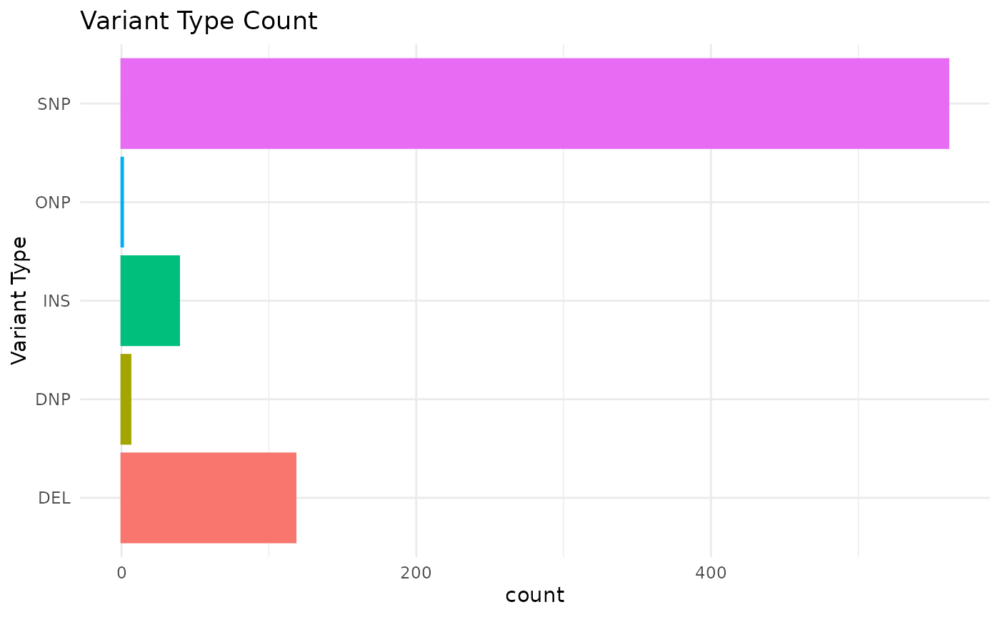
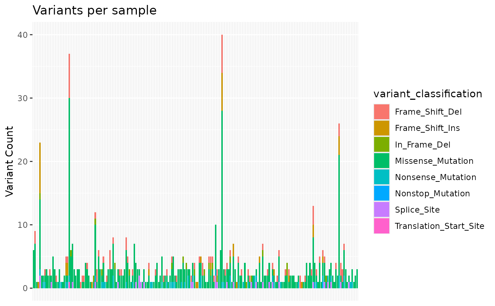
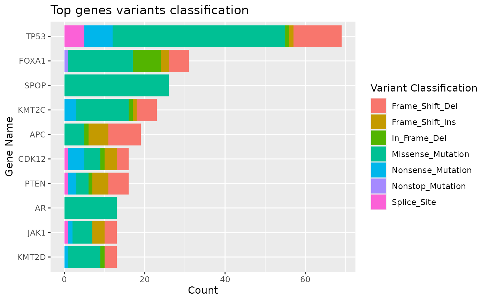
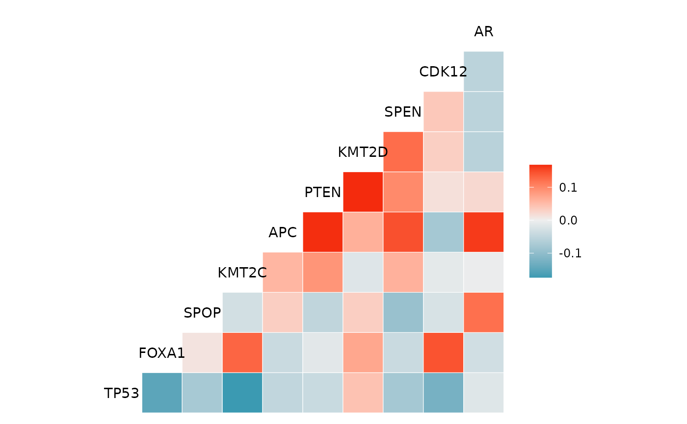
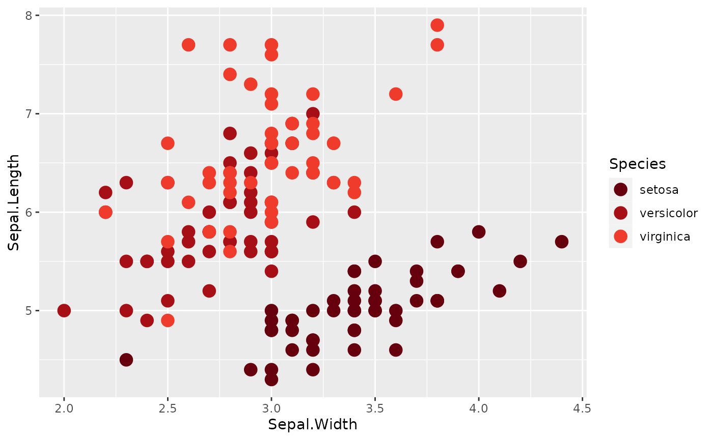
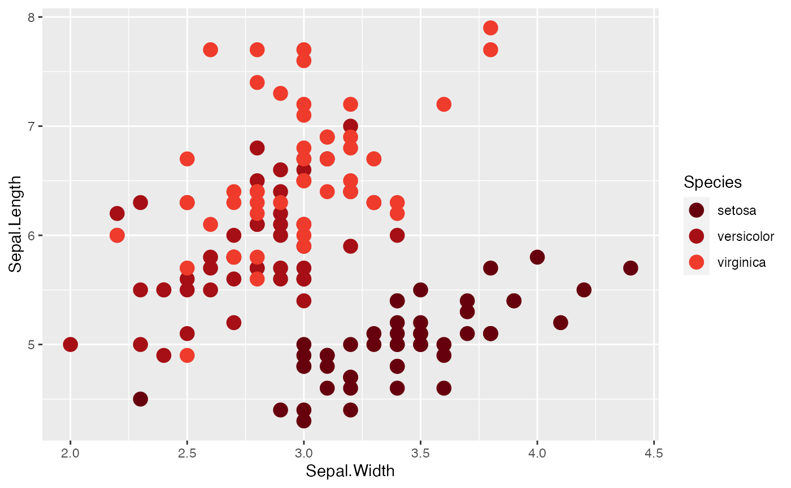
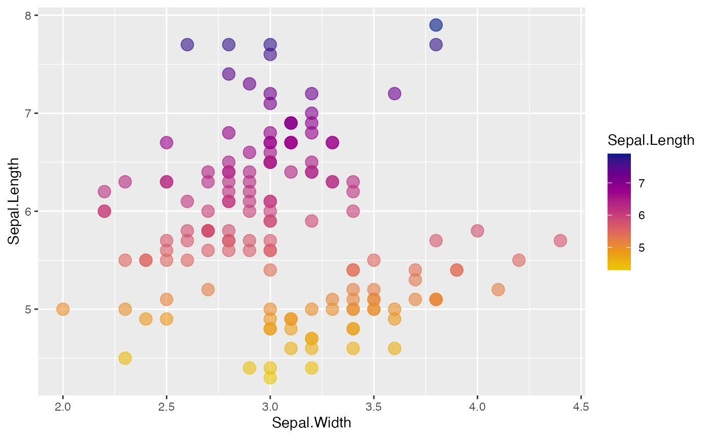
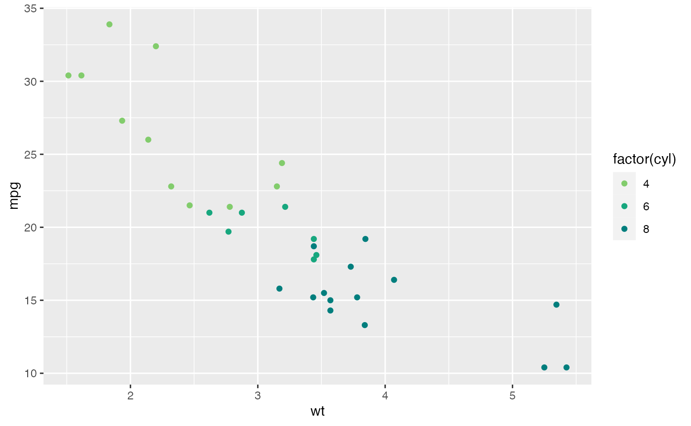
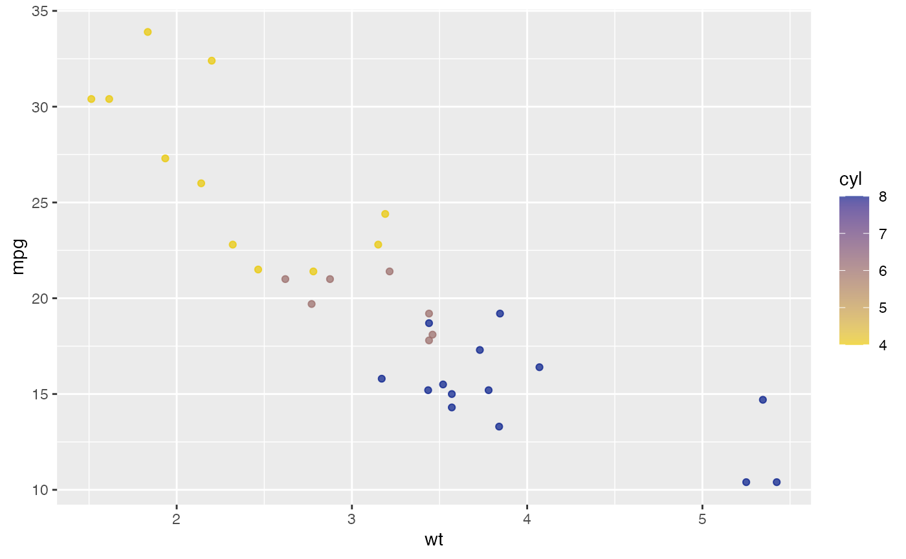
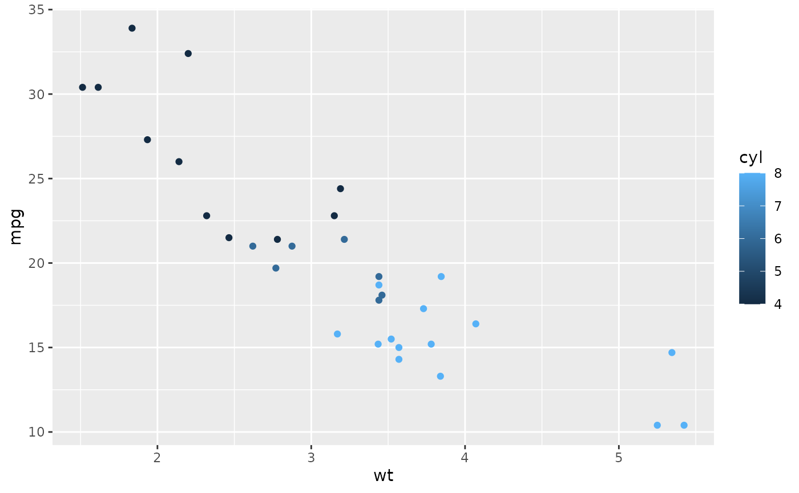

# Processing Data with {gnomeR}

## Introduction

In this vignette we will walk through a data example to show available
{gnomeR} data processing, visualization and analysis functions. We will
also outline some {gnomeR} helper functions to use when you encounter
common pitfalls and format inconsistencies when working with mutation,
CNA or structural variant data.

## Setting up

Make sure {gnomeR} is installed & loaded. We will use dplyr for the
purposes of this vignette as well.

``` r
library(gnomeR)
library(dplyr)
```

To demonstrate {gnomeR} functions, we will be using a random sample of
200 patients from a publicly available prostate cancer study retrieved
from cBioPortal. Data on mutations, CNA, and structural variants for
these patients are available in the gnomeR package
([`gnomeR::mutations`](https://mskcc-epi-bio.github.io/gnomeR/reference/mutations.md),
[`gnomeR::cna`](https://mskcc-epi-bio.github.io/gnomeR/reference/cna.md),
[`gnomeR::sv`](https://mskcc-epi-bio.github.io/gnomeR/reference/sv.md)).

Note: To access data from cBioPortal, you can use the {cbioportalR}
package: <https://github.com/karissawhiting/cbioportalR>.

## Data Formats

Mutation, CNA, or structural variant (also called fusion) data may be
formatted differently depending on where you source it. Below we outline
some differences you may encounter when downloading data from the
[cBioPortal website](https://www.cbioportal.org/) versus pulling it via
the [cBioPortal API](https://github.com/karissawhiting/cbioportalR), and
review the important/required columns for each. Example data in this
package was pulled using the API.

See [cBioPortal
documentation](https://docs.cbioportal.org/file-formats/) for more
details on different file formats supported on cBioPortal, and their
data schema and coding.

### Mutation Data

The most common mutation data format is the [Mutation Annotation Format
(MAF)](https://docs.gdc.cancer.gov/Data/File_Formats/MAF_Format/)
created as part of The Cancer Genome Atlas (TCGA) project. Each row in a
MAF file represents a unique gene for a specified sample, therefore
there are usually several rows per sample. To use MAF files, you need at
minimum a sample ID column and a hugo symbol column, though often
additional information like mutation type or location are also
necessary.

MAF formats are fairly consistent across sources, however if you
download the raw data from a study on cBioPortal using the interactive
download button you might notice some differences in the variables names
in comparison to data imported from the API. For instance, below
web-downloaded MAF names are on the left and API-downloaded MAF names
are on the right:

    * `Tumor_Sample_Barcode` is called `sampleId` 
    * `Hugo_symbol` is called `hugoGeneSymbol` 
    * `Variant_Classification` is called `mutationType`
    * `HGVSp_Short` is called `proteinChange`
    * `Chromosome` is called 'chr'

Some of the other variables are named differently as well but those
differences are more intuitive. You can refer to
[`gnomeR::names_df`](https://mskcc-epi-bio.github.io/gnomeR/reference/names_df.md)
for more information on possible MAF variable names.

Luckily, most {gnomeR} functions use the data dictionary in
[`gnomeR::names_df`](https://mskcc-epi-bio.github.io/gnomeR/reference/names_df.md)
to automatically recognize the most common MAF variable names and turn
them into clean, snakecase names in resulting dataframes. For example:

``` r
gnomeR::mutations %>% names()
#>  [1] "hugoGeneSymbol"        "entrezGeneId"          "uniqueSampleKey"      
#>  [4] "uniquePatientKey"      "molecularProfileId"    "sampleId"             
#>  [7] "patientId"             "studyId"               "center"               
#> [10] "mutationStatus"        "validationStatus"      "startPosition"        
#> [13] "endPosition"           "referenceAllele"       "proteinChange"        
#> [16] "mutationType"          "functionalImpactScore" "fisValue"             
#> [19] "linkXvar"              "linkPdb"               "linkMsa"              
#> [22] "ncbiBuild"             "variantType"           "keyword"              
#> [25] "chr"                   "variantAllele"         "refseqMrnaId"         
#> [28] "proteinPosStart"       "proteinPosEnd"
```

``` r
rename_columns(gnomeR::mutations) %>% names()
#>  [1] "hugo_symbol"            "entrez_gene_id"         "uniqueSampleKey"       
#>  [4] "uniquePatientKey"       "molecular_profile_id"   "sample_id"             
#>  [7] "patient_id"             "study_id"               "center"                
#> [10] "mutation_status"        "validation_status"      "start_position"        
#> [13] "end_position"           "reference_allele"       "hgv_sp_short"          
#> [16] "variant_classification" "functionalImpactScore"  "fisValue"              
#> [19] "linkXvar"               "linkPdb"                "linkMsa"               
#> [22] "ncbi_build"             "variant_type"           "keyword"               
#> [25] "chromosome"             "allele"                 "refseqMrnaId"          
#> [28] "protein_pos_start"      "protein_pos_end"
```

As you can see, some variables, such as `linkMsa`, were not transformed
because they are not used in {gnomeR} functions.

### CNA data

The discrete copy number data from cBioPortal contains values that would
be derived from copy-number analysis algorithms like GISTIC 2.0 or RAE.
CNA data is often presented in a long or wide format:

1.  Long-format - Each row is a CNA event for a given gene and sample,
    therefore samples often have multiple rows. This is most common
    format you will receive when downloading data using the API.

``` r
gnomeR::cna[1:6, ]
#> # A tibble: 6 × 9
#>   hugoGeneSymbol entrezGeneId uniqueSampleKey                   uniquePatientKey
#>   <chr>                 <int> <chr>                             <chr>           
#> 1 PTPRS                  5802 UC0wMDAxODU5LVQwMS1JTTM6cHJhZF9t… UC0wMDAxODU5OnB…
#> 2 AR                      367 UC0wMDAxODU5LVQwMS1JTTM6cHJhZF9t… UC0wMDAxODU5OnB…
#> 3 PIK3R1                 5295 UC0wMDAyMzA0LVQwMS1JTTM6cHJhZF9t… UC0wMDAyMzA0OnB…
#> 4 AR                      367 UC0wMDAzOTI1LVQwMS1JTTM6cHJhZF9t… UC0wMDAzOTI1OnB…
#> 5 PTEN                   5728 UC0wMDAwODI4LVQwMi1JTTM6cHJhZF9t… UC0wMDAwODI4OnB…
#> 6 B2M                     567 UC0wMDAwODI4LVQwMi1JTTM6cHJhZF9t… UC0wMDAwODI4OnB…
#> # ℹ 5 more variables: molecularProfileId <chr>, sampleId <chr>,
#> #   patientId <chr>, studyId <chr>, alteration <int>
```

2.  Wide-format - Organized such that there is one column per sample and
    one row per gene. Thus, each sample’s events are contained within
    one column. This is most common format you will receive when
    downloading data from the cBioPortal web browser.

``` r
gnomeR::cna_wide[1:6, 1:6]
#>   Hugo_Symbol P-0070637-T01-IM7 P-0042589-T01-IM6 P-0026544-T01-IM6
#> 1       SMAD4                 0                 0                -2
#> 2       CCND1                 0                 0                 0
#> 3         MYC                 0                 0                 0
#> 4        FGF4                 0                 0                 0
#> 5        FGF3                 0                 0                 0
#> 6       FGF19                 0                 0                 0
#>   P-0032011-T01-IM6 P-0049337-T01-IM6
#> 1                 0                 0
#> 2                 0                 2
#> 3                 0                 2
#> 4                 0                 2
#> 5                 0                 2
#> 6                 0                 2
```

{gnomeR} features two helper functions to easily pivot from wide- to
long-format and vice-versa.

``` r
pivot_cna_wider(rename_columns(gnomeR::cna))
pivot_cna_longer(gnomeR::cna_wide)
```

These functions will also relabel CNA levels (numeric values) to
characters as shown below:

| detailed_coding          | numeric_coding | simplified_coding |
|:-------------------------|:---------------|:------------------|
| neutral                  | 0              | neutral           |
| homozygous deletion      | -2             | deletion          |
| loh                      | -1.5           | deletion          |
| hemizygous deletion      | -1             | deletion          |
| gain                     | 1              | amplification     |
| high level amplification | 2              | amplification     |

{gnomeR} automatically checks CNA data labels and recodes as needed
within functions. You can also use the
[`recode_cna()`](https://mskcc-epi-bio.github.io/gnomeR/reference/recode_cna.md)
function to do it yourself if pivoting is unnecessary:

``` r
gnomeR::cna %>%
  mutate(alteration_recoded = recode_cna(alteration))%>%
  select(hugoGeneSymbol, sampleId, alteration, alteration_recoded)%>%
  head()
```

## Preparing Data For Analysis

### Process Data with `create_gene_binary()`

Often the first step to analyzing genomic data is organizing it in an
event matrix. This matrix will have one row for each sample in your
cohort and one column for each type of genomic event. Each cell will
take a value of `0` (no event on that gene/sample), `1` (event on that
gene/sample) or `NA` (missing data or gene not tested on panel). The
[`create_gene_binary()`](https://mskcc-epi-bio.github.io/gnomeR/reference/create_gene_binary.md)
function helps you process your data into this format for use in
downstream analysis.

You can
[`create_gene_binary()`](https://mskcc-epi-bio.github.io/gnomeR/reference/create_gene_binary.md)
from any single type of data (mutation, CNA or fusion):

``` r
create_gene_binary(mutation = gnomeR::mutations)[1:6, 1:6]
#> ! `samples` argument is `NULL`. We will infer your cohort inclusion and resulting data frame will include all samples with at least one alteration in mutation, fusion or cna data frames
#> ! 7 mutations have `NA` or blank in the mutationStatus column instead of 'SOMATIC' or 'GERMLINE'. These were assumed to be 'SOMATIC' and were retained in the resulting binary matrix.
#> # A tibble: 6 × 6
#>   sample_id         PARP1  AKT1   ALK   APC    AR
#>   <chr>             <dbl> <dbl> <dbl> <dbl> <dbl>
#> 1 P-0001128-T01-IM3     1     1     0     0     0
#> 2 P-0001859-T01-IM3     1     0     0     1     0
#> 3 P-0001895-T01-IM3     1     0     1     0     0
#> 4 P-0001845-T01-IM3     0     1     0     0     0
#> 5 P-0005570-T01-IM5     0     1     0     0     0
#> 6 P-0001768-T01-IM3     0     0     1     0     0
```

or you can process several types of alterations into a single matrix.
Supported data types are:

- mutations
- copy number amplifications
- copy number deletions
- gene fusions

All datasets should be in long-format.

When processing multiple types of alteration data, by default there will
be a separate column for each type of alteration on that gene. For
example, if the TP53 gene could have up to 4 columns: `TP53` (mutation),
`TP53.Amp` (amplification), `TP53.Del` (deletion), and `TP53.fus`
(structural variant). Further, if no events are observed within the data
set for a type of alteration (let’s say no TP53 mutations but some TP53
amplifications), columns with all zeros will be excluded. For example,
in `colnames(all_bin)` below, there is at least one `ERG.fus` event, but
no `ERG` mutation events.

Note the use of the `samples` argument. This allows you to specify
exactly which samples are in your resulting data frame. This argument
allows you to retain samples that have no genetic events as a row of `0`
and `NA`. If you do not specify such samples within your sample cohort,
rows with no alterations will be excluded from the final matrix.

``` r

samples <- unique(gnomeR::mutations$sampleId)[1:10]

all_bin <- create_gene_binary(
    samples = samples,
    mutation = gnomeR::mutations,
    cna = gnomeR::cna,
    fusion = gnomeR::sv
)

all_bin[1:6, 1:6]
#> # A tibble: 6 × 6
#>   sample_id         PARP1  AKT1   ALK   APC BRCA2
#>   <chr>             <dbl> <dbl> <dbl> <dbl> <dbl>
#> 1 P-0001128-T01-IM3     1     1     0     0     1
#> 2 P-0001859-T01-IM3     1     0     0     1     0
#> 3 P-0001895-T01-IM3     1     0     1     0     0
#> 4 P-0001845-T01-IM3     0     1     0     0     0
#> 5 P-0005570-T01-IM5     0     1     0     0     0
#> 6 P-0001768-T01-IM3     0     0     1     0     0

colnames(all_bin)
#>  [1] "sample_id"   "PARP1"       "AKT1"        "ALK"         "APC"        
#>  [6] "BRCA2"       "CTNNB1"      "EPHB1"       "FAT1"        "JAK1"       
#> [11] "SMAD2"       "MYC"         "NF1"         "PDGFRA"      "PIK3R2"     
#> [16] "PPP2R1A"     "ROS1"        "TP53"        "KMT2D"       "SPOP"       
#> [21] "PIK3R3"      "IRS2"        "SPEN"        "ASXL2"       "KMT2C"      
#> [26] "CARD11"      "ERG.fus"     "TMPRSS2.fus" "PTPRS.Del"   "KDM6A.Del"  
#> [31] "NKX3-1.Del"  "AR.Amp"      "TRAF7.Amp"   "TSC2.Amp"    "FGFR1.Amp"  
#> [36] "SOX17.Amp"   "RECQL4.Amp"  "MYC.Amp"     "NBN.Amp"
```

**Notes on some helpful
[`create_gene_binary()`](https://mskcc-epi-bio.github.io/gnomeR/reference/create_gene_binary.md)
arguments:**

- `mut_type`- by default, any germline mutations will be omitted because
  data is often incomplete, but you can choose to leave them in if
  needed.
- `specify_panel`- If you are working across a set of samples that was
  sequenced on several different gene panels, this argument will insert
  NAs for the genes that weren’t tested for any given sample. You can
  pass a string `"impact"` indicating automatically guessing panels and
  processsing IMPACT samples based on ID, or you can pass a data frame
  with columns sample_id and gene_panel for more fine grained control of
  NA annotation.
- `recode_aliases` - Sometimes genes have several accepted names or
  change names over time. This can be an issue if genes are coded under
  multiple names in studies, or if you are working across studies. By
  default, this function will search for aliases for genes in your data
  set and resolved them to their current most common name.

### Collapse Data with `summarize_by_gene()`

If the type of alteration event (mutation, amplification, deletion,
structural variant) does not matter for your analysis, and you want to
see if any event occurred for a gene, pipe your
[`create_gene_binary()`](https://mskcc-epi-bio.github.io/gnomeR/reference/create_gene_binary.md)
object through the
[`summarize_by_gene()`](https://mskcc-epi-bio.github.io/gnomeR/reference/summarize_by_gene.md)
function. As you can see, this compresses all alteration types of the
same gene into one column. So, where in `all_bin` there was an `ERG.fus`
column but no `ERG` column, now
[`summarize_by_gene()`](https://mskcc-epi-bio.github.io/gnomeR/reference/summarize_by_gene.md)
only has an `ERG` column with a `1` for any type of event.

``` r
dim(all_bin)
#> [1] 10 39
 
all_bin_summary <- all_bin %>% 
  summarize_by_gene()

all_bin_summary[1:6, 1:6]
#> # A tibble: 6 × 6
#>   sample_id         PARP1  AKT1   ALK   APC BRCA2
#>   <chr>             <dbl> <dbl> <dbl> <dbl> <dbl>
#> 1 P-0001128-T01-IM3     1     1     0     0     1
#> 2 P-0001859-T01-IM3     1     0     0     1     0
#> 3 P-0001895-T01-IM3     1     0     1     0     0
#> 4 P-0001845-T01-IM3     0     1     0     0     0
#> 5 P-0005570-T01-IM5     0     1     0     0     0
#> 6 P-0001768-T01-IM3     0     0     1     0     0
 
colnames(all_bin_summary)
#>  [1] "sample_id" "PARP1"     "AKT1"      "ALK"       "APC"       "BRCA2"    
#>  [7] "CTNNB1"    "EPHB1"     "FAT1"      "JAK1"      "SMAD2"     "NF1"      
#> [13] "PDGFRA"    "PIK3R2"    "PPP2R1A"   "ROS1"      "TP53"      "KMT2D"    
#> [19] "SPOP"      "PIK3R3"    "IRS2"      "SPEN"      "ASXL2"     "KMT2C"    
#> [25] "CARD11"    "ERG"       "TMPRSS2"   "PTPRS"     "KDM6A"     "NKX3-1"   
#> [31] "AR"        "TRAF7"     "TSC2"      "FGFR1"     "SOX17"     "RECQL4"   
#> [37] "NBN"       "MYC"
```

## Analyzing Data

Once you have processed the data into a binary format, you may want to
visualize and summarize it with the following helper functions:

### Summarize Alterations with `subset_by_frequency()` and `tbl_genomic()`

You can use the
[`subset_by_frequency()`](https://mskcc-epi-bio.github.io/gnomeR/reference/subset_by_frequency.md)
function along with
[`tbl_genomic()`](https://mskcc-epi-bio.github.io/gnomeR/reference/tbl_genomic.md)
function to easily display highest prevalence alterations in your data
set.

First, subset your data set by top genes at a give threshold (`t`). The
threshold is a value between 0 and 1 to indicate % prevalence cutoff to
keep. You can subset at this threshold on the alteration level:

``` r
top_prev_alts <- all_bin %>%
  subset_by_frequency(t = .1)

colnames(top_prev_alts)
#>  [1] "sample_id"   "ALK"         "PARP1"       "AKT1"        "APC"        
#>  [6] "BRCA2"       "TP53"        "FAT1"        "SMAD2"       "SPOP"       
#> [11] "SPEN"        "KMT2C"       "ERG.fus"     "TMPRSS2.fus" "AR.Amp"     
#> [16] "CTNNB1"      "EPHB1"       "JAK1"        "MYC"         "NF1"        
#> [21] "PDGFRA"      "PIK3R2"      "PPP2R1A"     "ROS1"        "KMT2D"      
#> [26] "PIK3R3"      "IRS2"        "ASXL2"       "CARD11"      "PTPRS.Del"  
#> [31] "KDM6A.Del"   "NKX3-1.Del"  "TRAF7.Amp"   "TSC2.Amp"    "FGFR1.Amp"  
#> [36] "SOX17.Amp"   "RECQL4.Amp"  "MYC.Amp"     "NBN.Amp"
```

Or gene level:

``` r
top_prev_genes <- all_bin_summary %>%
  subset_by_frequency(t = .1)

colnames(top_prev_genes)
#>  [1] "sample_id" "ALK"       "PARP1"     "AKT1"      "APC"       "BRCA2"    
#>  [7] "TP53"      "FAT1"      "SMAD2"     "SPOP"      "SPEN"      "KMT2C"    
#> [13] "ERG"       "TMPRSS2"   "AR"        "MYC"       "CTNNB1"    "EPHB1"    
#> [19] "JAK1"      "NF1"       "PDGFRA"    "PIK3R2"    "PPP2R1A"   "ROS1"     
#> [25] "KMT2D"     "PIK3R3"    "IRS2"      "ASXL2"     "CARD11"    "PTPRS"    
#> [31] "KDM6A"     "NKX3-1"    "TRAF7"     "TSC2"      "FGFR1"     "SOX17"    
#> [37] "RECQL4"    "NBN"
```

Next, we can pass our subset of genes or alterations to the
[`tbl_genomic()`](https://mskcc-epi-bio.github.io/gnomeR/reference/tbl_genomic.md)
function, which can be used to display summary tables of alterations. It
is built off the {gtsummary} package and therefore you can use most
customizations available in that package to alter the look of your
tables.

The `gene_binary` argument expects binary data as generated by the
[`create_gene_binary()`](https://mskcc-epi-bio.github.io/gnomeR/reference/create_gene_binary.md),
[`summarize_by_gene()`](https://mskcc-epi-bio.github.io/gnomeR/reference/summarize_by_gene.md)
or
[`subset_by_frequency()`](https://mskcc-epi-bio.github.io/gnomeR/reference/subset_by_frequency.md)
functions. Example below shows the summary using gene data for ten
samples.

In the example below for `tb1`, if the gene is altered in at least 15%
of samples, the gene is included in the summary table.

``` r
samples <- unique(mutations$sampleId)[1:10]

gene_binary <- create_gene_binary(
  samples = samples,
  mutation = mutations,
  cna = cna,
  mut_type = "somatic_only", snp_only = FALSE,
  specify_panel = "no"
)

tbl1 <- gene_binary %>% 
  subset_by_frequency(t = .15) %>%
  tbl_genomic() 
```

We can add additional customizations to the table with the following
gtsummary functions:

``` r
tbl1 %>%
  gtsummary::bold_labels() 
```

| **Characteristic** | **N = 10**¹ |
|--------------------|-------------|
| ALK                | 4 (40%)     |
| PARP1              | 3 (30%)     |
| AKT1               | 3 (30%)     |
| APC                | 3 (30%)     |
| BRCA2              | 3 (30%)     |
| TP53               | 3 (30%)     |
| FAT1               | 2 (20%)     |
| SMAD2              | 2 (20%)     |
| SPOP               | 2 (20%)     |
| SPEN               | 2 (20%)     |
| KMT2C              | 2 (20%)     |
| AR.Amp             | 2 (20%)     |
| ¹ n (%)            |             |

### Annotate Gene Pathways with `add_pathways()`

The
[`add_pathways()`](https://mskcc-epi-bio.github.io/gnomeR/reference/add_pathways.md)
function allows you add columns to your gene binary matrix that annotate
custom gene pathways, or oncogenic signaling pathways (add citation).

The function expects a binary matrix as obtained from the
`gene_binary()` function and will return a gene binary with additional
columns added for specified pathways.

There are a set of default pathways available in the package that can be
viewed using
[`gnomeR::pathways`](https://mskcc-epi-bio.github.io/gnomeR/reference/pathways.md)
([Sanchez-Vega, F et al.,
2018](https://pubmed.ncbi.nlm.nih.gov/29625050/)). This new data frame
will include columns for mutations, CNAs, structural variants, and
pathways. You can subset to only the pathways if you choose.

``` r
# available pathways
names(gnomeR::pathways)
#>  [1] "RTK/RAS"    "Nrf2"       "PI3K"       "TGFB"       "p53"       
#>  [6] "Wnt"        "Myc"        "Cell cycle" "Hippo"      "Notch"

pathways <- add_pathways(gene_binary, pathways = c("Notch", "p53")) %>%
  select(sample_id, pathway_Notch, pathway_p53)

head(pathways)
#> # A tibble: 6 × 3
#>   sample_id         pathway_Notch pathway_p53
#>   <chr>                     <dbl>       <dbl>
#> 1 P-0001128-T01-IM3             0           1
#> 2 P-0001859-T01-IM3             0           0
#> 3 P-0001895-T01-IM3             0           0
#> 4 P-0001845-T01-IM3             0           0
#> 5 P-0005570-T01-IM5             0           0
#> 6 P-0001768-T01-IM3             0           1
```

### Data Visualizations

The mutation_viz functions allows you to visualize data for the
variables related to variant classification, variant type, SNV class as
well as top variant genes.

``` r
mutation_viz(mutations)
#> $varclass
```


    #> 
    #> $vartype



    #> 
    #> $samplevar



    #> 
    #> $topgenes



    #> 
    #> $genecor



#### Customizing your colors

{gnomeR} comes with 3 distinct palettes that can be useful for plotting
high dimensional genomic data: `pancan`, `main`, and `sunset`. `pancan`
and `main` offer a wide range of colors that can be useful to map to
discrete scales. `sunset` has fewer colors but offers a color spectrum
useful for interpolation for continuous variables. You can view hex
codes of all colors with `gnomer_colors`, and the 3 distinct palettes
with `gnomer_palettes$pancan`, `gnomer_palettes$main`,
`gnomer_palettes$sunset`. The
[`gnomer_palette()`](https://mskcc-epi-bio.github.io/gnomeR/reference/gnomer_palette.md)
is used to set/subset specific palettes, create a continuous palette,
and/or plot palettes to show the user the specific colors they chose.

The code below will show the first 4 colors from the `pancan` palette
for a discrete palette.

``` r
gnomer_palette(
  name = "pancan",
  n = 4,
  type = "discrete",
  plot_col = TRUE,
  reverse = FALSE
)
```



    #> [1] "#67000D" "#A50F15" "#EF3B2C" "#FC9272"

If you wanted to make a continuous palette you can change the `type=`
option and specify how many colors your want to use to create a gradient
palette. `type = continuous` uses
[`grDevices::colorRampPalette()`](https://rdrr.io/r/grDevices/colorRamp.html)
as the engine to create the gradient palette. Additionally,
[`gnomer_palette()`](https://mskcc-epi-bio.github.io/gnomeR/reference/gnomer_palette.md)
accepts additional arguments to be passed to
[`colorRampPalette()`](https://rdrr.io/r/grDevices/colorRamp.html) with
the parameter `...`. The example below uses 20 colors.

``` r

gnomer_palette(
  name = "sunset",
  n = 20,
  type = "continuous",
  plot_col = TRUE,
  reverse = FALSE
)
```


    #>  [1] "#EAC800" "#EAB807" "#EAA80F" "#EA9817" "#E7892B" "#E37941" "#DF6A57"
    #>  [8] "#D85B65" "#CF4C6F" "#C73D79" "#BC2D80" "#B01C84" "#A40B88" "#96008B"
    #> [15] "#85008B" "#74008B" "#61018B" "#41088A" "#201089" "#001889"

Examples how to use
[`gnomer_palette()`](https://mskcc-epi-bio.github.io/gnomeR/reference/gnomer_palette.md):

``` r

library(ggplot2)

ggplot(iris, aes(Sepal.Width, Sepal.Length, color = Species)) +
  geom_point(size = 4) +
  scale_color_manual(values = gnomer_palette("pancan"))
```



``` r
# use a continuous color scale - interpolates between colors
ggplot(iris, aes(Sepal.Width, Sepal.Length, color = Sepal.Length)) +
  geom_point(size = 4, alpha = .6) +
  scale_color_gradientn(colors = 
                          gnomer_palette("sunset", type = "continuous"))
```



#### Set Color Palettes Globally

If you do not want to constantly have to set the palette for each plot
you can set a palette theme globally for your entire session using
[`set_gnomer_palette()`](https://mskcc-epi-bio.github.io/gnomeR/reference/set_gnomer_palette.md).
Additionally, you can set the discrete and gradient (appropriate for
continuous variables) palette independently. With the examples below you
can see the default colors change for each plot without having to call a
`scale_*` function.

``` r

set_gnomer_palette(palette = "main", gradient = "sunset")

ggplot(mtcars, aes(wt, mpg, color = factor(cyl))) +
  geom_point()
```



``` r

ggplot(mtcars, aes(wt, mpg, color = cyl)) +
  geom_point()
#> Warning: The `scale_name` argument of `continuous_scale()` is deprecated as of ggplot2
#> 3.5.0.
#> This warning is displayed once per session.
#> Call `lifecycle::last_lifecycle_warnings()` to see where this warning was
#> generated.
```



You can reset the palettes back to default ggplot color palettes with
[`reset_gnomer_palette()`](https://mskcc-epi-bio.github.io/gnomeR/reference/reset_gnomer_palette.md).

``` r
reset_gnomer_palette()

ggplot(mtcars, aes(wt, mpg, color = cyl)) +
  geom_point()
```


